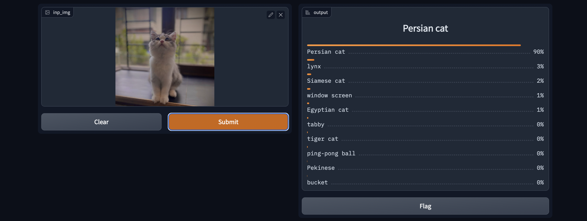
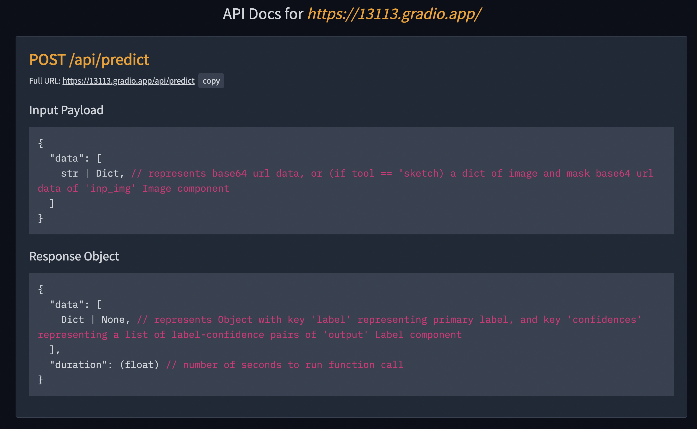
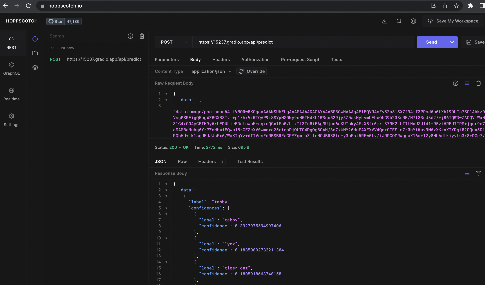
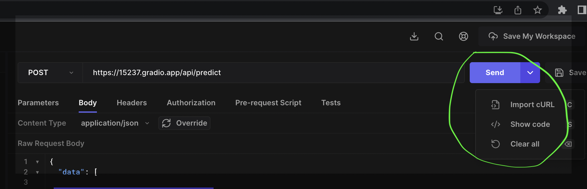
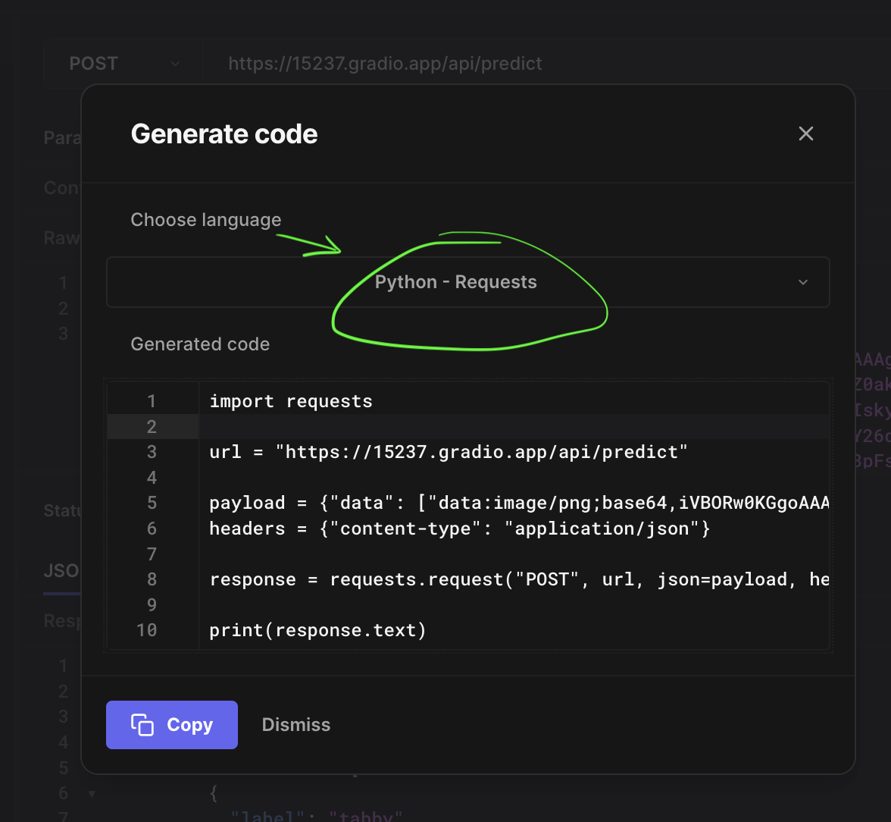
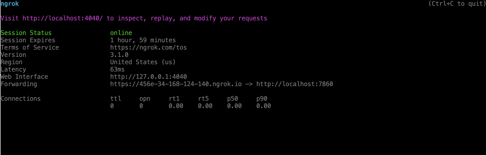
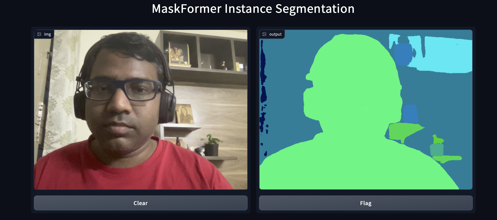

# Use of Gradio for demo app UI

https://gradio.app/docs/

### Very easy and fast

Install Gradio
```
pip install gradio
```

Install torch
```
pip3 install torch torchvision torchaudio --extra-index-url https://download.pytorch.org/whl/cpu
```

**torch hub** : collection of models , (timm has its own model repo)

**Interface** has inputs : where you can specify one or more text, images etc.

Gradio Image Params : look params for image
https://gradio.app/docs/#image

When you specify ```launch(share=True)``` One opened in local along with a public url

Run app visionApp.py 
```
gradio visionApp.py
```


💡 When **Flag** is clicked it, saves input & output. Can be used to log false positives.

### End points & APIs

Go to bottom of the app page and Click on **view api**

The Full URL of the enpoints is something ```https://15237.gradio.app/api/predict```


**View API docs** as below




### Test API

Use  https://hoppscotch.io or https://www.postman.com/

We will use hoppscotch for demo-

- As the API is POST select POST

- Paste the full URL https://15237.gradio.app/api/predict

- Go to Body and Set the content type to ```application/json```

- Paste the input Payload in the body & convert your image to base64 using online tool (https://www.base64-image.de/) and paste it as value.

Paste within double quotes as shown below, also note it starts with **data:image/png;base64,**iVBORw0KGgoAAA......

```
{
  "data": [
  ""
  ]
}
```




Use code for others to make a request 





### Tunneling and Public URL

When not using gradio.io for public URL, you can do tunneling where you forward the public url to your local machine where it infers and pass back the response.

[NGROK](https://ngrok.com/)

1. Install on your machine (local or server), I m using Linux so...

```
curl -s https://ngrok-agent.s3.amazonaws.com/ngrok.asc | sudo tee /etc/apt/trusted.gpg.d/ngrok.asc >/dev/null && echo "deb https://ngrok-agent.s3.amazonaws.com buster main" | sudo tee /etc/apt/sources.list.d/ngrok.list && sudo apt update && sudo apt install ngrok
```

2. Signup an account at https://ngrok.com/, get token and connect by running something like ...

```
ngrock config add-authtoken <your token here>
```

3. See which port you app in running in your local machine (mine is 7860)

```
ngrok http 7860
```

4. Use 




## Inference on Live Webcam

Example Source code ```webcamlive.py```


## Segmentation Model (Run in Colab)

Look at notebook - LiveSegmentation_GPU.ipnyb



# Ref:

Install Torch -
```
pip3 install torch torchvision torchaudio --extra-index-url https://download.pytorch.org/whl/cpu
```

1. Image input is send to APIs by connverting it to base64

2. API URL Verbs : GET, PUT - Update, POST - providing data ...

3. $htop To see cpu usage while inference 

